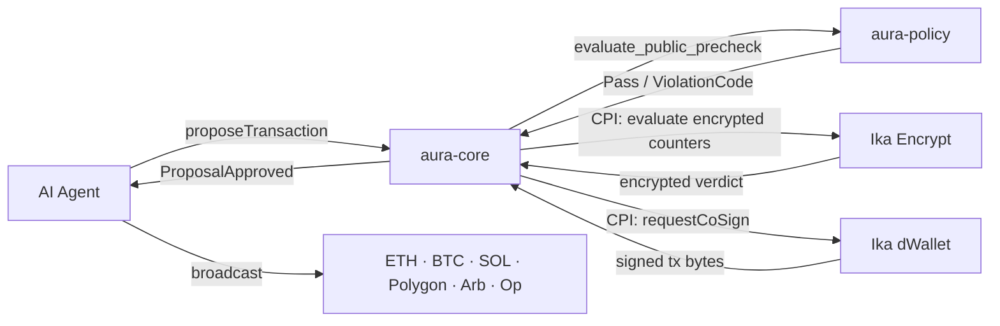

import { Card, Cards } from 'fumadocs-ui/components/card';

**AURA** (Autonomous Universal Resource Agent) is an Anchor program on Solana that lets AI agents manage real crypto treasuries without exposing spending strategy on-chain and without trusting a centralized approval server.

The core insight: an agent needs to spend money autonomously, but the rules governing that spending — daily limits, velocity caps, counterparty restrictions — must be enforced without being readable by observers. AURA solves this with a two-layer policy system: public rules evaluated locally in Rust, and confidential spend counters evaluated over FHE ciphertexts by the Ika Encrypt network.

## Core Guarantees

| Guarantee | Mechanism |
|---|---|
| Spending limits never leak | Daily and per-tx limits stored as `EUint64` FHE ciphertexts; evaluated over encrypted values by Ika Encrypt |
| No raw private key exposure | Execution co-signed by Ika dWallet records; agent receives signed bytes, not the key |
| No trusted approval server | Policy runs on-chain (`aura-policy`) + Ika network; no centralized oracle |
| Multi-chain reach | dWallet supports Bitcoin, Ethereum, Solana, Polygon, Arbitrum, Optimism from one treasury |
| Auditable | Append-only on-chain audit trail for every proposal, decision, and governance action |
| Composable | `check_policy_cpi` lets external programs query AURA policy before executing their own logic |

## Program IDs

| Resource | Address |
|---|---|
| `aura-core` (devnet) | `EaRoLVwL8EErDUeEMPHJ5QJeLVQZWJMtZcgmFzT9bhHs` |
| Ika dWallet program | `87W54kGYFQ1rgWqMeu4XTPHWXWmXSQCcjm8vCTfiq1oY` |
| Ika Encrypt program | `4ebfzWdKnrnGseuQpezXdG8yCdHqwQ1SSBHD3bWArND8` |
| Ika Encrypt gRPC | `pre-alpha-dev-1.encrypt.ika-network.net:443` |
| Ika dWallet gRPC | `pre-alpha-dev-1.ika.ika-network.net:443` |

## Status

Pre-alpha. Under active development on Solana devnet. Program instructions, account layouts, policy semantics, and SDK APIs may change. Not production-ready for real funds until a stable release and audit are published.

## Key Components

<Cards>
  <Card
    title="Architecture"
    description="How aura-core, aura-policy, and the Ika network fit together. Account model, request lifecycle, and package boundaries."
    href="/docs/overview/architecture"
  />
  <Card
    title="Confidential Guardrails"
    description="FHE-backed spend limits. How EUint64 ciphertexts are stored, evaluated, and decrypted without leaking values."
    href="/docs/overview/confidential-guardrails"
  />
  <Card
    title="dWallet Execution"
    description="Multi-chain co-signing via Ika dWallet. MessageApproval PDA derivation, curve codes, and the execute_pending CPI."
    href="/docs/overview/dwallet-execution"
  />
  <Card
    title="Policy Engine"
    description="All 27 ViolationCodes, evaluation order, public precheck vs full evaluation, and PolicyConfig defaults."
    href="/docs/overview/policy-engine"
  />
</Cards>
