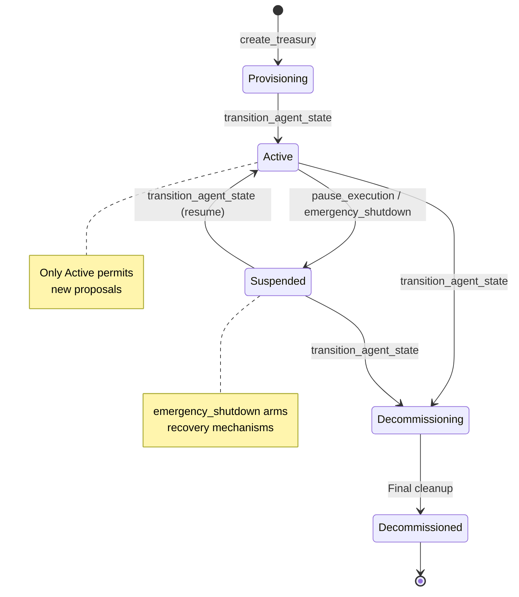

import { Callout } from 'fumadocs-ui/components/callout';

## Lifecycle State Machine

## Treasury lifecycle

| Instruction | Description | |
|---|---|---|
| `create_treasury` | Create the treasury PDA with an initial policy + fee schedule. | |
| `update_treasury_metadata` | Edit mutable settings (pending-tx TTL, high-risk threshold/guardian, sanctions toggle) in place. | <New /> |
| `migrate_treasury` | Realloc + advance the account to the current schema version. | |
| `transition_agent_state` | Move the agent between lifecycle states. | |
| `pause_execution` | Pause / resume all execution. | |
| `emergency_shutdown` | Halt the treasury and record a recovery pubkey. | |
| `trigger_dead_mans_switch` | Fire the inactivity switch after the threshold elapses. | |

<Callout title="Lifecycle states">
  Treasuries progress through states: **Provisioning** → **Active** → **Suspended** → **Decommissioning** → **Decommissioned**. 
  Only the **Active** state permits new proposals. State transitions are audited and most require owner authority.
</Callout>
