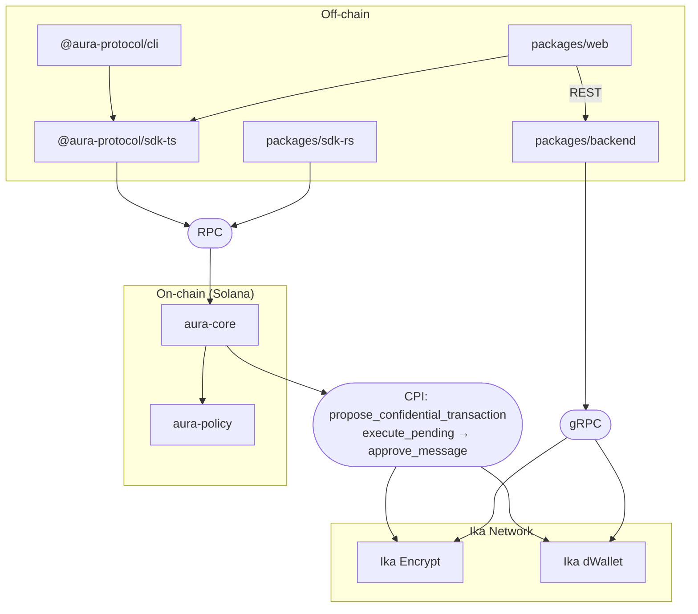
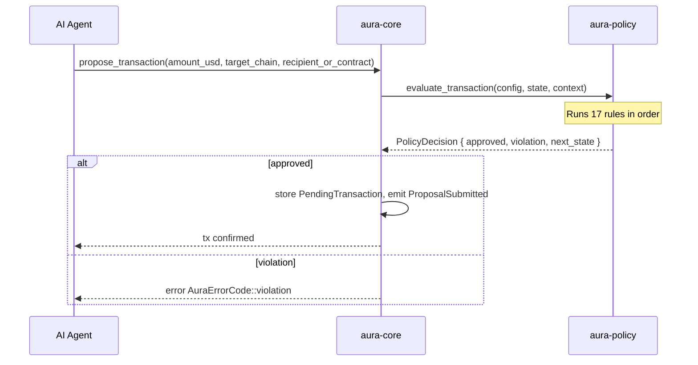
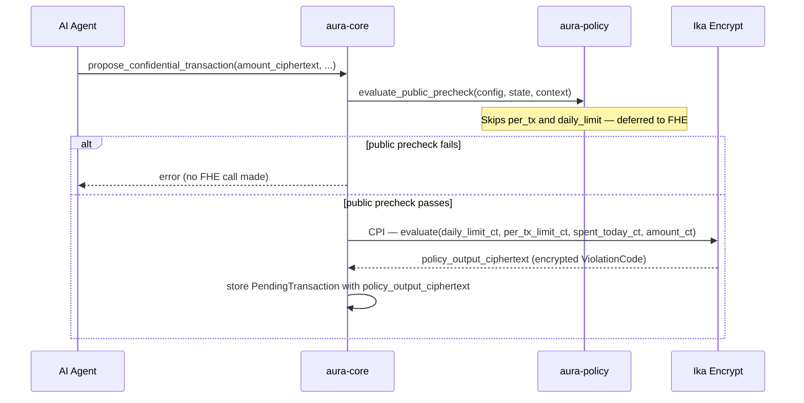
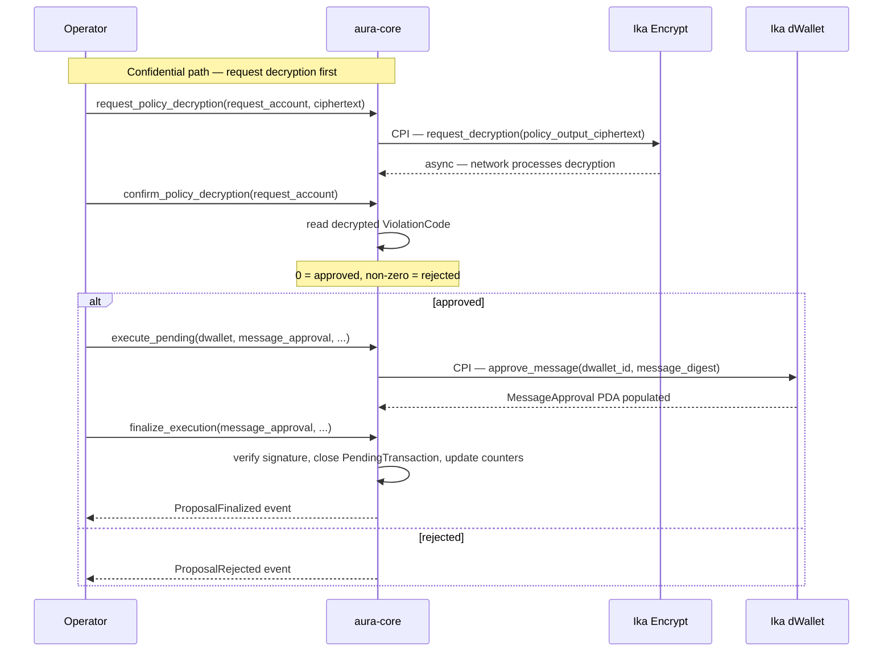
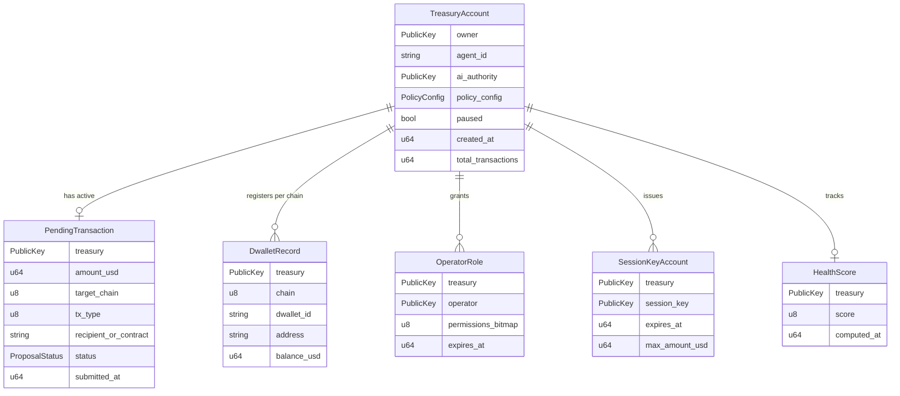
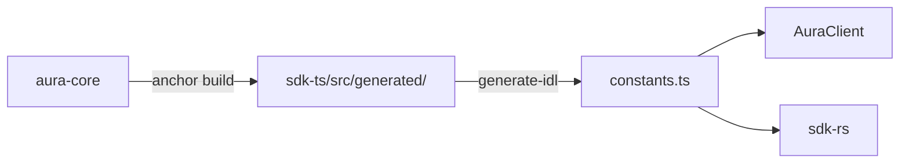

import { Card, Cards } from 'fumadocs-ui/components/card';

## System Overview

## Package Responsibilities

| Package | Language | Role |
|---|---|---|
| `programs/aura-core` | Rust / Anchor 1.0.0 | On-chain program — treasury state machine, instruction handlers, CPIs to Encrypt and dWallet |
| `programs/aura-policy` | Pure Rust (no Anchor) | Policy engine — 27 violation codes, `evaluate_transaction`, `evaluate_public_precheck`, `evaluate_batch` |
| `packages/sdk-rs` | Rust | Sync RPC client, account decoding, PDA derivation, typed instruction builders |
| `packages/sdk-ts` | TypeScript | Anchor IDL wrappers, `AuraClient`, `Aura` facade, PDA helpers, event types |
| `packages/backend` | TypeScript / Node | Confidential bridge, agent runtime, SIWS auth, gRPC wrappers for Encrypt + dWallet |
| `packages/cli` | TypeScript | Commander CLI with Ink dashboard for all treasury operations |
| `packages/web` | TypeScript / Next.js 16 | Browser dashboard — wallet adapter, Radix UI, TanStack Query |

## Request Lifecycle

### Public proposal (`propose_transaction`)

### Confidential proposal (`propose_confidential_transaction`)

### Execution (`execute_pending` → `finalize_execution`)

## Account Model

All AURA accounts are PDAs. The treasury is the root; all other accounts are derived from it.

## PDA Seeds

All seeds mirror `programs/aura-core/src/constants.rs` and are exported from `packages/sdk-ts/src/constants.ts`.

| Account | Seeds | Derivation program |
|---|---|---|
| Treasury | `["treasury", owner, agentId]` | `aura-core` |
| dWallet CPI authority | `["__ika_cpi_authority"]` | `aura-core` |
| Encrypt CPI authority | `["__encrypt_cpi_authority"]` | `aura-core` |
| Encrypt event authority | `["__event_authority"]` | Ika Encrypt |
| MessageApproval | `["dwallet", curveCode+pubkey chunks, "message_approval", schemeCode, digest]` | Ika dWallet |
| Policy receipt | `["policy_receipt", treasury, proposalId_le64]` | `aura-core` |
| Policy simulation | `["policy_simulation", treasury, simulationId_le64]` | `aura-core` |
| Budget envelope | `["budget_envelope", treasury, envelopeId_le64]` | `aura-core` |
| Exposure group | `["exposure_group", authority, groupId_16bytes]` | `aura-core` |
| Operator role | `["operator_role", treasury, operator]` | `aura-core` |
| External liveness | `["external_liveness", treasury]` | `aura-core` |
| Policy attestation | `["policy_attestation", treasury, attester, policyVersion_le64]` | `aura-core` |
| Batch proposal | `["batch_proposal", treasury, batchId_le64]` | `aura-core` |
| Invariant report | `["invariant_report", treasury, reportId_le64]` | `aura-core` |

## Source of Truth

The on-chain program is the source of truth. SDKs wrap the generated IDL rather than redefining instructions by hand.

After any program change: `anchor build` → `npm run generate-idl` (or `:win` on Windows) in `packages/sdk-ts` → update SDK wrappers.

<Cards>
  <Card title="Confidential Guardrails" description="FHE ciphertexts, CPI accounts, and the decryption flow." href="/overview/confidential-guardrails" />
  <Card title="dWallet Execution" description="MessageApproval PDA, curve codes, and co-signing." href="/overview/dwallet-execution" />
  <Card title="Policy Engine" description="All 27 ViolationCodes and evaluation order." href="/overview/policy-engine" />
  <Card title="TypeScript SDK" description="AuraClient and Aura facade." href="/sdk-ts" />
</Cards>
