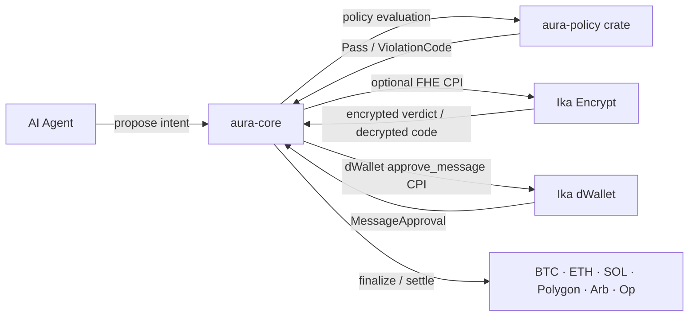

import { Card, Cards } from "fumadocs-ui/components/card";

**AURA** (Autonomous Universal Resource Agent) is an Anchor program on Solana that turns an AI agent into a governed treasury operator. Agents can propose payments, swaps, payroll runs, scheduled intents, and chain-bound settlements, but `aura-core` controls whether those actions can move toward a dWallet signature.

The core object is an **agent treasury**: a Solana PDA system that stores policy, dWallet registrations, operator/session permissions, pending proposals, governance controls, recovery paths, receipts, fees, and risk state. Confidential guardrails are one branch of that system, not the whole product.

## Core Guarantees

| Guarantee                   | Mechanism                                                                                                   |
| --------------------------- | ----------------------------------------------------------------------------------------------------------- |
| Spending limits never leak  | Daily and per-tx limits stored as `EUint64` FHE ciphertexts; evaluated over encrypted values by Ika Encrypt |
| No raw private key exposure | Execution is co-signed by Ika dWallet records; the agent never holds the signing key                        |
| No trusted approval server  | Policy is enforced inside `aura-core` with shared `aura-policy` rules and Ika attestations                   |
| Multi-chain reach           | dWallet supports Bitcoin, Ethereum, Solana, Polygon, Arbitrum, Optimism from one treasury                   |
| Auditable                   | Proposal receipts, events, analytics sidecars, snapshots, and policy history record execution state         |
| Composable                  | `check_policy_cpi` lets external programs query AURA policy before executing their own logic                |

## Program IDs

| Resource             | Address                                        |
| -------------------- | ---------------------------------------------- |
| `aura-core` (devnet) | `auraEgX8ZUK3Xr8X81aRfgyTmoyNdsdfL6XfDN8W1ce`  |
| Ika dWallet program  | `87W54kGYFQ1rgWqMeu4XTPHWXWmXSQCcjm8vCTfiq1oY` |
| Ika Encrypt program  | `4ebfzWdKnrnGseuQpezXdG8yCdHqwQ1SSBHD3bWArND8` |
| Ika Encrypt gRPC     | `pre-alpha-dev-1.encrypt.ika-network.net:443`  |
| Ika dWallet gRPC     | `pre-alpha-dev-1.ika.ika-network.net:443`      |

## Status

Pre-alpha. Under active development on Solana devnet. Program instructions, account layouts, policy semantics, and SDK APIs may change. Not production-ready for real funds until a stable release and audit are published.

## Key Components

<Cards>
  <Card
    title="Architecture"
    description="How aura-core, the aura-policy crate, and the Ika network fit together. Account model, request lifecycle, and package boundaries."
    href="/overview/architecture"
  />
  <Card
    title="Confidential Guardrails"
    description="The confidential branch: how EUint64 ciphertexts are stored, evaluated, and decrypted without leaking values."
    href="/overview/confidential-guardrails"
  />
  <Card
    title="dWallet Execution"
    description="Multi-chain co-signing via Ika dWallet. MessageApproval PDA derivation, curve codes, and the execute_pending CPI."
    href="/overview/dwallet-execution"
  />
  <Card
    title="Policy Engine"
    description="All 27 ViolationCodes, decision traces, public precheck vs full evaluation, and PolicyConfig defaults."
    href="/overview/policy-engine"
  />
</Cards>
