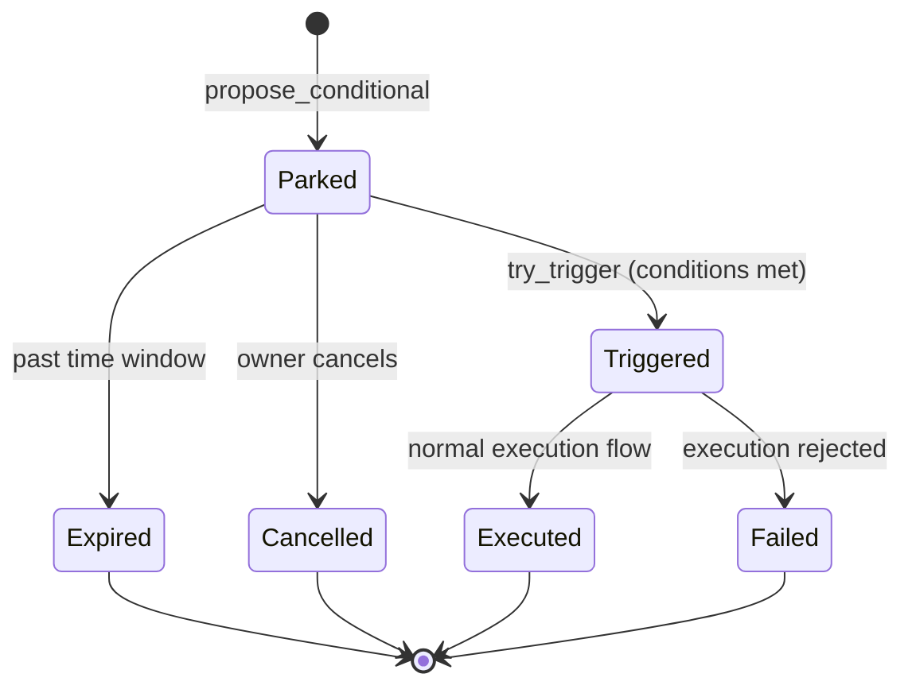

import { Callout } from "fumadocs-ui/components/callout";

AURA supports **interval-based recurring transactions** and **condition-based triggers**, allowing AI agents to set up governed spending patterns that keepers can promote into the normal proposal flow.

## Scheduled Intents

A `ScheduledIntent` represents a recurring transaction pattern with budget controls:

```typescript
import { instructions } from "@aura-protocol/sdk-ts";

await instructions.execution.sendCreateScheduledIntent(
  client,
  owner,
  createScheduledIntentInput,
);
```

**Execution:**
- A caller invokes `execute_scheduled_intent` when `Clock::unix_timestamp >= next_run_at`; if `keeper` is set, only that key may trigger it
- Intent checks on-chain clock, conditions, and budgets
- If satisfied, promotes a pending proposal into the execution queue
- Policy evaluation runs normally (limits, velocity, etc.)

**Budget tracking:**
- `spent_usd` increments when the promoted proposal settles through the normal finalization path
- `runs_completed` tracks settled runs
- `in_flight_proposal_id` and `in_flight_usd` reserve the promoted run until it settles or is cleared
- `max_runs`, `end_at`, and `total_budget_usd` stop future execution; the account is closed explicitly with `close_scheduled_intent`

<Callout title="In-flight protection">
While a promoted run is pending, the intent cannot be executed again. Use `clear_scheduled_intent_in_flight` to recover from abandoned proposals.
</Callout>

## Recurrence

Scheduled intents use a fixed `interval_secs` cadence with `start_at`, optional `end_at`, optional `max_runs`, `catch_up`, and `skip_on_deny` controls.

```typescript
args: {
  intervalSecs: 86_400, // daily cadence
  startAt,
  endAt: null,
  maxRuns: 30,
  catchUp: false,
}
```

## Conditional Proposals

Park a proposal behind runtime conditions instead of executing immediately:

```typescript
await instructions.execution.sendProposeConditionalTransaction(
  client,
  aiAuthority,
  proposeConditionalInput,
);
```

**Trigger mechanism:**
- Conditional proposal stored in `ConditionalProposal` PDA
- Any caller invokes `try_trigger` periodically
- On-chain conditions evaluated:
  - Price feeds checked through verified Pyth/Switchboard descriptors or the raw legacy path
  - Time windows checked against `Clock` sysvar
  - Balance and oracle-flag conditions evaluated from the condition context
- If all conditions satisfied, proposal promoted into pending queue

**Lifecycle:**


<Callout type="info">
If conditions are already satisfied at creation, the proposal is promoted immediately and the normal policy engine runs once. Otherwise it is parked, and policy runs when `try_trigger` later promotes it.
</Callout>

## Managing Intents

**Pause/Resume:**
```typescript
await instructions.execution.sendPauseScheduledIntent(client, owner, pauseInput);
await instructions.execution.sendResumeScheduledIntent(client, owner, resumeInput);
```

**Update budget or conditions:**
```typescript
await instructions.execution.sendUpdateScheduledIntent(client, owner, updateInput);
```

**Close intent:**
```typescript
await instructions.execution.sendCloseScheduledIntent(client, owner, closeInput);
```

Closing is refused if an in-flight promoted run is still pending.

## Use Cases

**Scheduled intents:**
- Daily yield harvests
- Weekly treasury rebalancing
- Monthly subscription payments
- Periodic liquidity provisioning

**Conditional proposals:**
- Buy-the-dip orders (trigger when price drops)
- Take-profit exits (trigger when price rises)
- Time-windowed actions (execute only during configured windows)
- Oracle-gated compliance actions

**Combined:**
- Recurring intent with price condition: "Every Monday, if ETH < $2500, buy $1000"
- Conditional proposal with balance guard: "When price hits target, sell only if balance > $10k"

## Keeper Infrastructure

Scheduled and conditional execution requires off-chain keepers to call `execute_scheduled_intent` and `try_trigger`. AURA treasuries can:

1. Run their own keeper infrastructure
2. Use external keeper networks
3. Delegate to protocol-operated keepers

<Callout title="Permissionless execution">
`try_trigger` is permissionless. `execute_scheduled_intent` is permissionless only when the intent has no `keeper`; otherwise it is restricted to that configured keeper. Keeper incentives can be funded from the fee vault.
</Callout>

## Related Instructions

- `create_scheduled_intent` — Create recurring transaction
- `update_scheduled_intent` — Edit recurrence/budget
- `pause_scheduled_intent` / `resume_scheduled_intent` — Toggle execution
- `close_scheduled_intent` — Close intent
- `execute_scheduled_intent` — Run a due slot
- `clear_scheduled_intent_in_flight` — Recover from abandoned run
- `propose_conditional_transaction` — Create conditional proposal
- `try_trigger` — Attempt to trigger conditional
- `close_conditional_proposal` — Clean up conditional proposal
