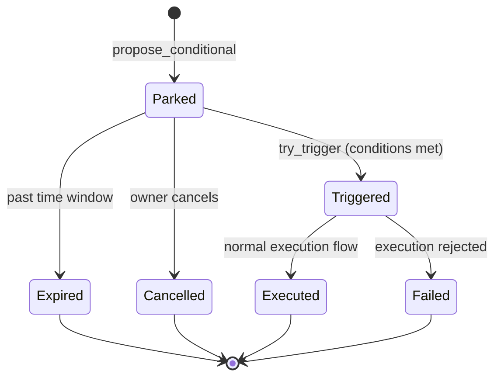

import { Callout } from "fumadocs-ui/components/callout";

AURA supports **time-based recurring transactions** and **condition-based triggers**, allowing AI agents to set up autonomous spending patterns without manual intervention for each execution.

## Scheduled Intents

A `ScheduledIntent` represents a recurring transaction pattern with budget controls:

```typescript
await aura.scheduled.createIntent({
  treasury,
  recurrence: {
    type: "interval",
    intervalSecs: 86400, // daily
  },
  perRunBudgetUsd: 500, // max $5 per execution
  totalBudgetUsd: 10_000, // max $100 total across all runs
  maxExecutions: 30, // stop after 30 runs
  payload: {
    chain: 1, // Ethereum
    recipient: "0xVaultAddress",
    txType: 0, // Transfer
    amountUsd: 450, // $4.50 per run
  },
  conditions: {
    minBalanceUsd: 1000, // only run if treasury balance >= $10
    maxGasPrice: 50_000_000_000, // 50 gwei max
  },
});
```

**Execution:**
- Keeper or permissionless caller invokes `execute_scheduled_intent` when the next slot is due
- Intent checks on-chain clock, conditions, and budgets
- If satisfied, promotes a pending proposal into the execution queue
- Policy evaluation runs normally (limits, velocity, etc.)

**Budget tracking:**
- `spent_so_far` increments with each successful run
- `executions_count` tracks how many times it ran
- Intent closes automatically when `maxExecutions` or `totalBudgetUsd` is reached

<Callout title="In-flight protection">
While a promoted run is pending, the intent cannot be executed again. Use `clear_scheduled_intent_in_flight` to recover from abandoned proposals.
</Callout>

## Recurrence Patterns

| Type | Description | Example |
|---|---|---|
| **Interval** | Fixed seconds between runs | Every 24 hours |
| **Cron-like** | Specific times/days | Every Monday at 9 AM UTC |
| **Slot-based** | Every N Solana slots | Every 432,000 slots (~2 days) |

```typescript
// Cron-style: every Monday at 09:00 UTC
recurrence: {
  type: "cron",
  dayOfWeek: 1, // 0=Sunday, 1=Monday
  hourUtc: 9,
  minuteUtc: 0,
}

// Slot-based: every 100k slots
recurrence: {
  type: "slot",
  slotInterval: 100_000,
}
```

## Conditional Proposals

Park a proposal behind runtime conditions instead of executing immediately:

```typescript
await aura.scheduled.proposeConditional({
  treasury,
  proposal: {
    chain: 1,
    recipient: "0xTargetAddress",
    amountUsd: 2000,
    txType: 1, // DeFiSwap
  },
  conditions: {
    priceAbove: { asset: "ETH", priceUsd: 3000 }, // wait for ETH > $3000
    timeWindow: { startUnix: 1700000000, endUnix: 1700086400 }, // within 24h window
    minBalance: 5000, // treasury balance >= $50
    oracleFlag: { feedAddress: "...", mustBe: true }, // custom oracle condition
  },
});
```

**Trigger mechanism:**
- Conditional proposal stored in `ConditionalProposal` PDA
- Keeper/permissionless caller invokes `try_trigger` periodically
- On-chain conditions evaluated:
  - Price feeds checked via Pyth/Switchboard oracle
  - Time windows checked against `Clock` sysvar
  - Balance checked against treasury aggregate
  - Oracle flags checked via CPI to external program
- If all conditions satisfied, proposal promoted into pending queue

**Lifecycle:**


<Callout type="info">
Conditional proposals are policy-checked **twice**: once when created (soft check) and again when triggered (hard enforcement).
</Callout>

## Managing Intents

**Pause/Resume:**
```typescript
await aura.scheduled.pauseIntent({ treasury, intentId });
await aura.scheduled.resumeIntent({ treasury, intentId });
```

**Update budget or conditions:**
```typescript
await aura.scheduled.updateIntent({
  treasury,
  intentId,
  perRunBudgetUsd: 600, // raise per-run cap
  conditions: { minBalanceUsd: 2000 }, // tighter balance requirement
});
```

**Close intent:**
```typescript
await aura.scheduled.closeIntent({ treasury, intentId });
```

Closing is refused if an in-flight promoted run is still pending.

## Use Cases

**Scheduled intents:**
- Daily yield harvests
- Weekly treasury rebalancing
- Monthly subscription payments
- Periodic liquidity provisioning

**Conditional proposals:**
- Buy-the-dip orders (trigger when price drops)
- Take-profit exits (trigger when price rises)
- Time-window arbitrage (execute only during low-gas periods)
- Oracle-gated compliance actions

**Combined:**
- Recurring intent with price condition: "Every Monday, if ETH < $2500, buy $1000"
- Conditional proposal with balance guard: "When price hits target, sell only if balance > $10k"

## Keeper Infrastructure

Scheduled and conditional execution requires off-chain keepers to call `execute_scheduled_intent` and `try_trigger`. AURA treasuries can:

1. Run their own keeper infrastructure
2. Use permissionless keeper networks (Clockwork, Jito, etc.)
3. Delegate to protocol-operated keepers

<Callout title="Permissionless execution">
Both `execute_scheduled_intent` and `try_trigger` are permissionless — anyone can call them. Keeper incentives can be funded from the fee vault.
</Callout>

## Related Instructions

- `create_scheduled_intent` — Create recurring transaction
- `update_scheduled_intent` — Edit recurrence/budget
- `pause_scheduled_intent` / `resume_scheduled_intent` — Toggle execution
- `close_scheduled_intent` — Close intent
- `execute_scheduled_intent` — Run a due slot
- `clear_scheduled_intent_in_flight` — Recover from abandoned run
- `propose_conditional_transaction` — Create conditional proposal
- `try_trigger` — Attempt to trigger conditional
- `close_conditional_proposal` — Clean up conditional proposal
