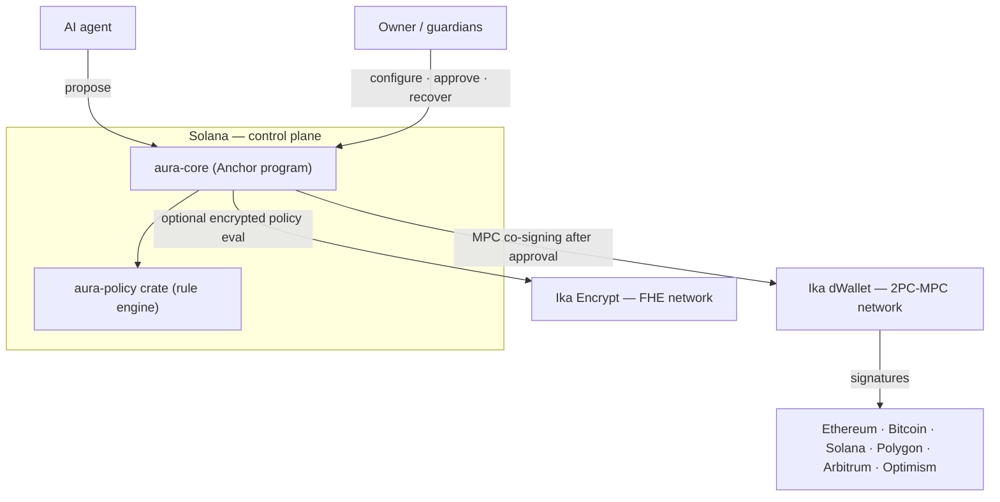
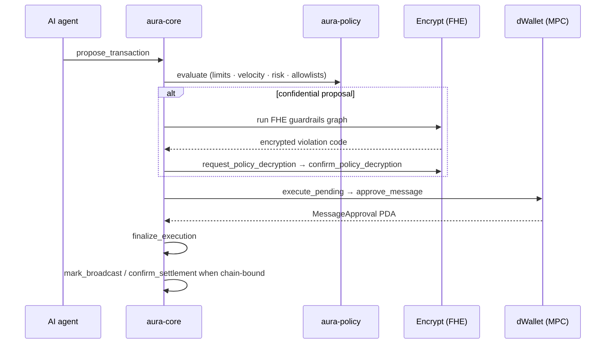

import { Callout } from 'fumadocs-ui/components/callout';
import { Card, Cards } from 'fumadocs-ui/components/card';

<Callout type="warn" title="Pre-alpha — devnet only">
  The program is deployed to Solana **devnet** and depends on the Ika Encrypt and dWallet **pre-alpha**
  networks. Account layouts, instruction discriminators, and the IDL may change. Do not secure real funds.
</Callout>

**AURA** is a deployed Anchor program plus a shared policy crate:

- **`aura-core`** — the deployed Anchor program. It owns the `TreasuryAccount` PDA and the full instruction
  surface: creating and operating agent treasuries, registering dWallets, evaluating policy, requesting FHE
  decryption, requesting dWallet signatures, and finalizing execution.
- **`aura-policy`** — a pure-Rust policy engine with no Anchor dependency. It is linked into `aura-core`
  and reused by tests/tooling for simulation and preview, so the same rules govern both paths.

| | |
|---|---|
| **Program ID (devnet)** | `auraEgX8ZUK3Xr8X81aRfgyTmoyNdsdfL6XfDN8W1ce` |
| **On-chain IDL** | `Eior2CvitsWmDH9vJ6VPCxTW169UaM2sw9dupCLNdoQT` — fetch with `anchor idl fetch auraEgX8ZUK3Xr8X81aRfgyTmoyNdsdfL6XfDN8W1ce` |
| **Loader** | BPF Upgradeable |

## Why it's split this way

A treasury controlled by an autonomous agent has to satisfy three things at once: keep the agent's strategy
**private**, let it **operate freely** within limits, and make those limits **impossible to bypass**. AURA
separates concerns to achieve that:

- **Solana is the control plane.** All policy, limits, approvals, and audit live in `aura-core`. It never
  holds external-chain keys.
- **Confidential guardrails** are the private branch for encrypted spend checks. The core treasury-embedded
  path covers daily and per-transaction limits; the sidecar-backed extended path can also enforce a weekly
  limit. The Encrypt network returns only a small violation code, never the private limits.
- **Execution is MPC-signed.** Approved proposals are co-signed through Ika dWallet records, so the agent is
  never handed a raw private key, and one Solana program can act across six chains.

## How a proposal flows

A spend is never a single call — it moves through a policy gate, an optional confidential branch, an
MPC-signing step, and a finalize step. Each stage is enforced on-chain.

For public proposals the policy decision is computed by `aura-core` through the linked `aura-policy` crate; for confidential proposals the
amount-sensitive checks run under encryption on the Encrypt network. Either way, the dWallet signature is only
requested **after** policy approves.

## Explore the reference

<Cards>
  <Card title="Instructions" href="/program/instructions" description="The full instruction catalog, grouped by entity." />
  <Card title="Accounts" href="/program/accounts" description="The treasury PDA and every auxiliary account, with seeds." />
  <Card title="Errors" href="/program/errors" description="Program error codes and what triggers them." />
</Cards>

<Callout title="SDK wrappers">
  This section documents the program directly (instructions, accounts, errors). The
  [TypeScript SDK](/sdk-ts) and [Rust SDK](/sdk-rs) wrap these into typed client methods — when a
  new instruction lands here, the SDK pages are updated to match.
</Callout>
