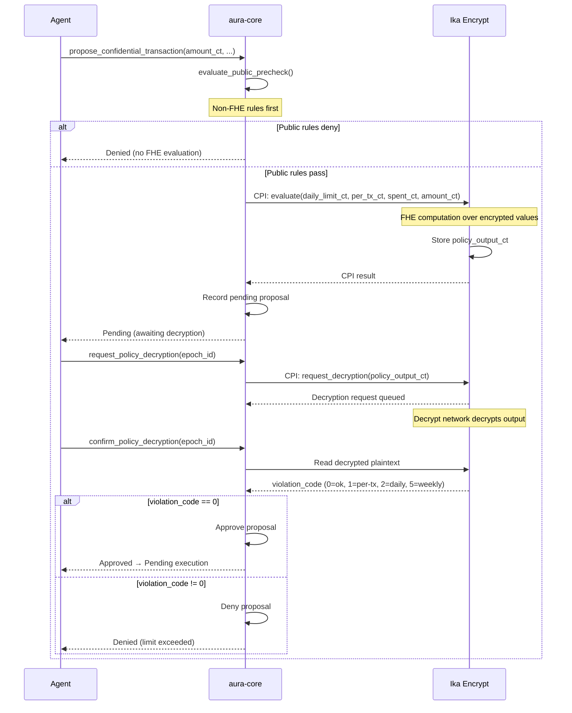

import { Callout } from 'fumadocs-ui/components/callout';

## FHE Evaluation Flow

## Confidential (FHE)

| Instruction | Description |
|---|---|
| `configure_confidential_guardrails` | Set the encrypted daily/per-tx limit + spent-counter ciphertexts (treasury-embedded).
| `request_policy_decryption` | Request decryption of the encrypted policy output, optionally binding the request to the current confidential guardrail epoch.
| `confirm_policy_decryption` | Verify the decrypted policy output, enforce any bound guardrail epoch, and apply the result (maps `5 → WeeklyLimit`).

`propose_confidential_transaction` runs a scalar FHE graph over the encrypted limits. By default it enforces
per-tx + daily. When the optional `weekly_limit_ciphertext` + `weekly_spent_ciphertext` accounts and the
guardrails sidecar are supplied, it runs the **extended** graph, which also enforces the **weekly** limit
under encryption and tracks the encrypted daily + weekly spent counters in update mode — returning a single
combined violation code (`0` ok, `1` per-tx, `2` daily, `5` weekly). The sidecar must be enabled and its
weekly pointers must match the supplied accounts.

<Callout title="Confidentiality scope">
  The encrypted amount is not yet bound to the executed amount; that still requires an Encrypt-network
  plaintext commitment. The decryption boundary now accepts scalar policy outputs whose first lane is the
  public verdict and whose optional second `EUint64` lane carries `next_spent_today`; when present, the
  decrypted counter must match the projected spend before the clear counter is advanced.
</Callout>

`request_policy_decryption(now, current_epoch_id)` and
`confirm_policy_decryption(now, current_epoch_id)` accept an optional
`ConfidentialGuardrailsAccount`. When the sidecar is supplied at request time, the request records
`guardrail_epoch_id`; confirmation requires the same epoch to still be current and returns
`GuardrailEpochMismatch` if the guardrails were rotated mid-flight.

## Confidential guardrail lifecycle

A sidecar `ConfidentialGuardrailsAccount` carries the expanded confidential posture (Encrypt **epoch** marker,
`enabled` flag, and the encrypted limit/counter ciphertext pointers) — kept off the treasury record for
stack-frame headroom. The epoch marker lets a long-lived confidential treasury rotate its ciphertexts when the
Encrypt network key rotates instead of silently breaking; the propose/decrypt path rejects a stale epoch
(`GuardrailEpochMismatch`). Each ciphertext is re-validated as an Encrypt-owned, verified `u64` on write.

| Instruction | Description |
|---|---|
| `init_confidential_guardrails` | Create the sidecar with the core ciphertext pointers under an epoch (enabled).
| `update_confidential_guardrails` | Re-point any subset of ciphertexts (idempotent; absent fields unchanged).
| `rotate_confidential_guardrails` | Swap ciphertexts to a new Encrypt epoch and stamp the epoch marker (audited).
| `reset_confidential_counters` | Re-point the encrypted counter ciphertexts to freshly-zeroed ones at a new day/epoch.
| `disable_confidential_guardrails` | Disable confidential evaluation (fall back to public policy) without teardown.
| `close_confidential_guardrails` | Close the sidecar and reclaim rent.
