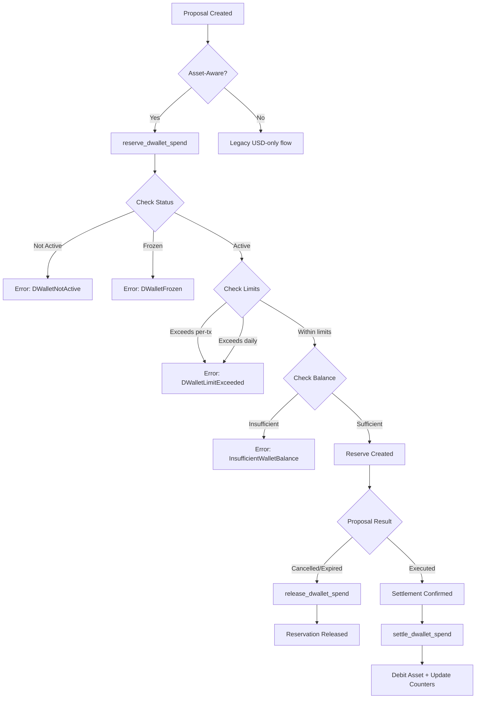

import { Callout } from 'fumadocs-ui/components/callout';

## dWallet Transfer Flow

## dWallets

| Instruction | Description |
|---|---|
| `register_dwallet` | Register (or update runtime metadata for) a dWallet on a chain.
| `refresh_dwallet_balance` | Refresh a dWallet's stored USD balance from its oracle.
| `init_dwallet_state` | Create the per-dWallet runtime account (status, limits, asset ledger) for a chain.
| `set_default_chain` | Set/clear the treasury's preferred ("primary") execution chain.

Each registered dWallet has a **separate runtime account** (`DWalletAccount`,
one PDA per chain) holding its controls, multi-asset ledger, and spend
reservation — kept out of the size-capped treasury account.

## dWallet controls

| Instruction | Description |
|---|---|
| `set_dwallet_status` | Transition the dWallet lifecycle (active / freeze / retire).
| `set_dwallet_limits` | Set/clear the per-dWallet daily + per-tx USD limits.
| `set_dwallet_label` | Set/clear a human-readable label.
| `rotate_dwallet_authority` | Rotate the controlling authority + CPI authority seed (bumps the rotation epoch).
| `remove_dwallet` | Remove a dWallet and close its runtime account (must be empty/retired, not the default chain, no pending proposal).

## dWallet balances

| Instruction | Description |
|---|---|
| `record_deposit` | Credit a deposit onto the asset ledger (accumulates or creates a row).
| `refresh_asset_balance` | Insert/replace a tracked asset's native amount + USD valuation.
| `set_asset_feed` | Set/clear the price-feed account on a tracked asset.
| `set_asset_oracle_feed` | Set/clear the verified oracle feed account for a tracked asset; trusted providers require a feed account, owner program, staleness bound, and confidence bound.
| `refresh_verified_asset_balance` | Refresh a tracked asset from its stored feed account using the verified oracle adapter, normalized native amount, and USD price.
| `reconcile_dwallet_balance` | Recompute the treasury's cached aggregate balance from the asset ledger.

## dWallet transfers

| Instruction | Description |
|---|---|
| `reserve_dwallet_spend` | Reserve available balance ahead of an outbound proposal (enforces status, limits, and available balance).
| `settle_dwallet_spend` | Release the reservation, record the spend, and debit the named asset row after settlement.
| `release_dwallet_spend` | Return a reservation without spending (cancel/expire path).

<Callout title="Multi-asset ledger">
  Each `DWalletAccount` maintains a per-asset ledger with native amounts, USD valuations, and price feeds.
  Asset-aware proposals reserve specific assets during execution.
</Callout>
