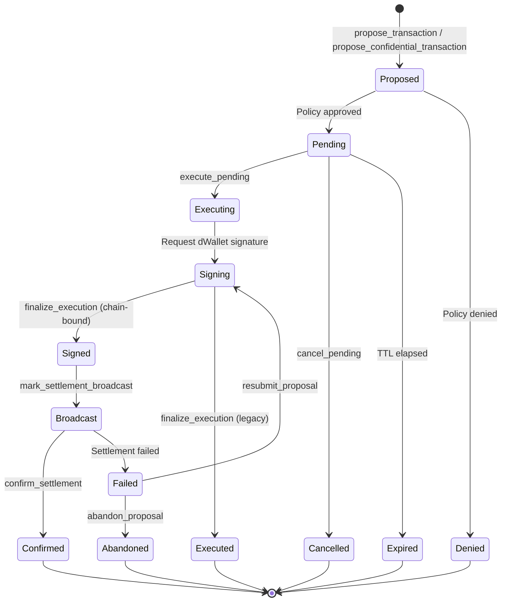

import { Callout } from 'fumadocs-ui/components/callout';

## Proposal Lifecycle

Public proposals can be legacy USD-only or **asset-aware**. When `asset_id`, `native_amount`,
`decimals`, or gas fields are provided, the proposal digest and dWallet message bind that concrete
asset payload. Approved asset-aware proposals reserve the matching `DWalletAccount`; cancellation,
expiry, and settlement release or settle that reservation.

Public proposals can also carry **chain execution binding** fields. EVM proposals bind the expected
`chain_id`, replay nonce, gas limit, max fee, and optional calldata hash. Bitcoin proposals bind the
UTXO set hash and sighash type. Solana proposals bind the recent blockhash and message hash. When any
binding is present, `finalize_execution` proves only that the dWallet signature exists; the proposal
stays pending until `confirm_settlement` observes the required target-chain confirmations.

Custom chain codes use a governance-managed `ChainProfileAccount` for address format, replay scheme,
curve/scheme, native gas asset, optional EVM chain id, finality model, and required confirmations.

## Proposals & execution

| Instruction | Description |
|---|---|
| `propose_transaction` | Submit a public proposal; runs the policy engine and optionally reserves an asset-aware dWallet transfer.
| `propose_confidential_transaction` | Submit a confidential (FHE) proposal, with optional asset-aware transfer binding.
| `propose_batch` | Preview/propose a batch of transactions.
| `propose_confidential_batch` | Create a confidential batch record from packed Encrypt `EUint64Vector` amount + per-item-limit ciphertexts, then submit the vector item-limit graph.
| `approve_pending_execution` | Satisfy an approval-ladder level on a pending proposal.
| `execute_pending` | Advance a pending proposal toward execution; expired proposals persist cleanup and release any asset reservation.
| `finalize_execution` | Verify the dWallet signature. Legacy and unbound asset-aware proposals settle here; chain-bound proposals move to `Signed` and wait for settlement confirmation.
| `mark_settlement_broadcast` | Mark a signed chain-bound proposal as broadcast after the relayer submits the target-chain transaction hash.
| `confirm_settlement` | Confirm target-chain settlement for a chain-bound proposal, then settle wallet reservations, scheduled intent counters, policy counters, and aggregate balances.
| `resubmit_proposal` | Replace chain replay fields after a failed/reorged broadcast, clear the signature request, and return the proposal to signing.
| `abandon_proposal` | Cancel a failed chain-bound proposal and release any reserved dWallet spend.
| `cancel_pending` | Owner cancels the pending proposal and releases any matching asset-aware reservation.

<Callout title="Batch inputs">
  Confidential batch inputs are provisioned off-chain as fixed-width Encrypt vectors and referenced on-chain by
  ciphertext accounts. The public `item_count` names how many leading `EUint64Vector` lanes are active
  (`1..=8`); unused lanes must be padded by the client before submission.
</Callout>

## Chain profiles

| Instruction | Description |
|---|---|
| `register_chain_profile` | Create a profile for a built-in or custom chain code, including address format, replay scheme, curve/scheme, gas asset, finality model, and confirmations.
| `update_chain_profile` | Enable/disable or update an existing chain profile.
