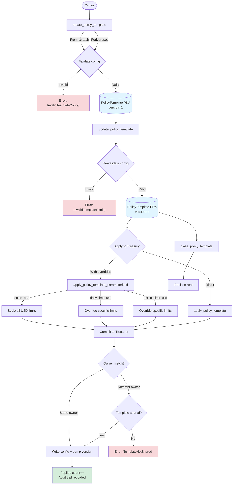
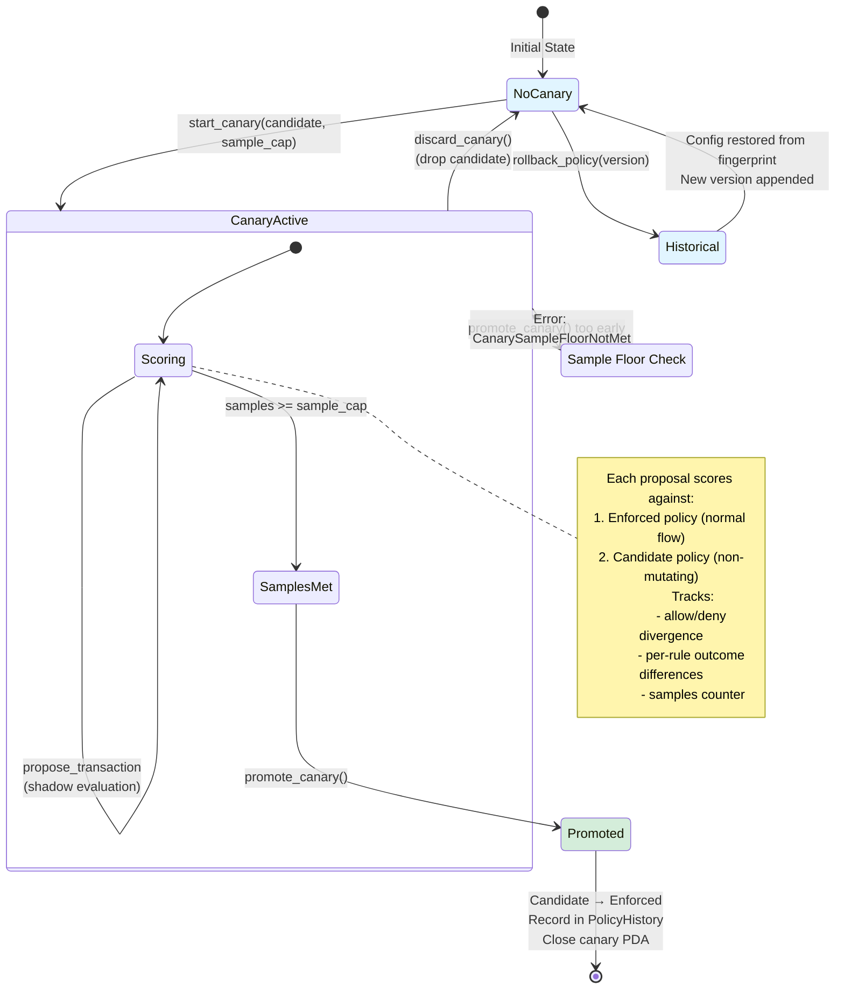

import { Callout } from 'fumadocs-ui/components/callout';

## Policy configuration

| Instruction | Description |
|---|---|
| `apply_policy_preset` | Apply a built-in policy preset (10 kinds; coherence-validated).
| `propose_config_change` | Stage a timelocked policy-config change.
| `execute_config_change` | Execute a staged config change after the timelock.
| `veto_config_change` | Guardian veto of a staged config change.
| `configure_approval_ladder` | Configure amount/risk approval escalation.
| `set_scoped_pause` | Pause a specific chain/category/recipient/protocol scope.
| `configure_budget_envelope` | Create/upsert a scoped budget envelope.
| `remove_budget_envelope` | Remove a budget envelope (refused while a matching proposal is pending).
| `set_recipient_limit` | Add/update a per-recipient daily + per-tx exposure cap.
| `remove_recipient_limit` | Remove a per-recipient limit.

The `PolicyConfig` also carries a **failure-mode** map (`Enforce` / `Warn` / `Degrade` / `Skip` per
softenable check, with a bounded fail-open budget). Hard money caps, pauses, approvals, sanctions, and
frozen wallets are always enforced and have no softening field.

## Policy templates

User-authored, reusable policy postures stored in a standalone `PolicyTemplate` PDA — coherence-validated,
optionally forked from a built-in preset, and applied (optionally parameterized) across treasuries.

| Instruction | Description |
|---|---|
| `create_policy_template` | Author a template from a config or fork a built-in preset (validated).
| `update_policy_template` | Overwrite the config/metadata and bump the version (re-validated).
| `close_policy_template` | Close a template and reclaim rent.
| `apply_policy_template` | Apply a template's config to a treasury (shared templates allow foreign owners).
| `apply_policy_template_parameterized` | Apply with overrides (bps scaling / limit overrides) without mutating the template.

## Policy versioning, rollback & canary

Make policy changes safe to ship and trivial to undo. `record_policy_snapshot` writes a full-config
fingerprint into the `PolicyHistory` ring; `rollback_policy` restores a recorded version, and a canary
trials a candidate against live traffic before promotion.

| Instruction | Description |
|---|---|
| `rollback_policy` | Restore a recorded version (caller supplies the full config; it must hash to the recorded fingerprint). Applies immediately when it does not loosen, otherwise stages through the config-change timelock. Always appended as a new forward version.
| `start_canary` | Stage a candidate policy and begin scoring it against live proposals (validated; never enforced).
| `promote_canary` | Promote the candidate into the enforced policy, record it as a new version, and close the canary (refused before the sample floor).
| `discard_canary` | Drop the candidate and close the canary, leaving the enforced policy untouched.

<Callout title="Canary scoring">
  While a canary is enabled, `propose_transaction` accepts an optional `policy_canary` account: each proposal
  is scored a second time against the candidate (non-mutating) and the allow/deny + per-rule divergence is
  tallied on the canary account. The candidate is never enforced.
</Callout>
