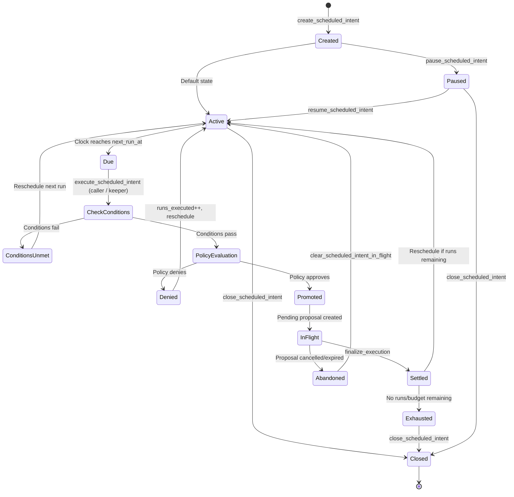

import { Callout } from 'fumadocs-ui/components/callout';

## Scheduled Intent Lifecycle

## Scheduled intents

On-chain standing orders (payroll / DCA / sweeps) in a `ScheduledIntent` PDA. Each due run is gated by the
**same** policy + failure-mode path as an interactive proposal, then promoted into the normal pending
proposal/sign/finalize lifecycle. Schedule counters and lifetime spend are settled when `finalize_execution`
receives the matching scheduled intent account. Optional **trigger conditions** can gate each run
(price / time-window / balance / oracle flag, combined with AND/OR). Price and oracle-flag conditions carry
the same oracle descriptor used by verified balance refresh, so trusted-oracle mode blocks raw spoofable
feeds there too.

| Instruction | Description |
|---|---|
| `create_scheduled_intent` | Create a recurring intent with recurrence, per-run/total budget, and conditions.
| `update_scheduled_intent` | Edit the recurrence / budget / payload / conditions.
| `pause_scheduled_intent` / `resume_scheduled_intent` | Toggle execution on/off.
| `close_scheduled_intent` | Close an intent and reclaim rent, unless a promoted run is still in flight.
| `clear_scheduled_intent_in_flight` | Owner-gated recovery for an abandoned promoted run after its proposal is no longer pending.
| `execute_scheduled_intent` | Run a due slot using the on-chain clock and promote an approved run into a pending proposal. Permissionless when `keeper` is unset; otherwise only the configured keeper may call it.

## Conditional proposals

Conditional proposals are parked until their trigger conditions pass. A successful trigger promotes the
request into the normal pending proposal flow and records `Triggered`; it does **not** mark the request
executed. Signing, finalization, cancellation, and expiry still happen through the ordinary pending
instructions.

| Instruction | Description |
|---|---|
| `propose_conditional_transaction` | Park a proposal behind price, time-window, balance, or oracle-flag conditions.
| `try_trigger` | Keeper/caller checks conditions and promotes a satisfied proposal into the pending queue.
| `close_conditional_proposal` | Close the conditional proposal after it is expired, cancelled, or no longer has a promoted pending proposal.

<Callout title="Policy enforcement">
  Both scheduled and conditional proposals go through the full policy engine when promoted. 
  They are not a bypass — they are a scheduling primitive.
</Callout>
