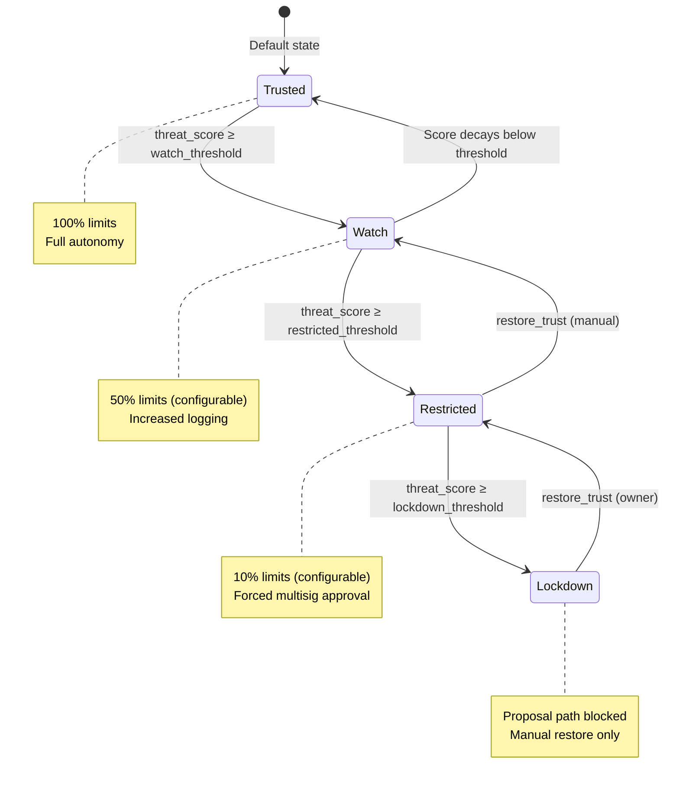

import { Callout } from 'fumadocs-ui/components/callout';

## Trust Tier Transitions

## Trust envelope & enforcement

Trust state lives on a per-treasury `TrustIdentityAccount` PDA (see [Accounts](/program/accounts)),
created once by `init_trust_identity`. It carries a `TrustTier` (Trusted → Watch → Restricted → Lockdown)
derived from a decaying `threat_score`. Denials, anomalies, and fail-open abuse accumulate score; clean
activity decays it. The tier multiplier is applied on top of the reputation multiplier in
`effective_daily_limit_usd`, shrinking the operating envelope proportionally. Lockdown is the only
non-auto-recoverable state; when the trust account is supplied to the proposal path, it blocks new proposals
until the owner calls `restore_trust`.

| Instruction | Description |
|---|---|
| `init_trust_identity` | Creates the `TrustIdentityAccount` PDA for a treasury (one-time) with default settings.
| `configure_trust_policy` | Owner sets the tier thresholds, per-tier multipliers, and decay rate.
| `restore_trust` | Owner steps the tier down by one. The only path out of Lockdown.

## Agent identity & ownership handover

Replaces the single `ai_authority` with a bounded list of **scoped agent authorities** and adds a
timelocked path to hand treasury control to a new owner (the owner key is a PDA seed and cannot
change in place).

| Instruction | Description |
|---|---|
| `register_agent` | Owner registers a secondary agent with allowed chains, tx types, and an optional per-agent daily cap.
| `revoke_agent` | Owner disables an agent authority (non-urgent path).
| `emergency_revoke_agent` | Owner or any registered guardian immediately disables an agent (no timelock). For active-compromise response.
| `nominate_successor_owner` | Owner or any registered guardian nominates a new owner; timelocked 48 h.
| `execute_ownership_handover` | After the timelock: transfers one dWallet's ownership to the successor's CPI authority. Call once per dWallet; set `finalize = true` on the last call to decommission the old treasury.

## Agent capability manifest & tripwires

Turns each agent's scope into a declarative **capability manifest** — allowed chains, tx types,
DeFi protocols (bitmap), privileged instructions (bitmap), per-agent daily and per-transaction USD
caps, optional recipient/asset allow-list accounts, and an optional active-time window. The direct
`propose_transaction` gate enforces chain, tx type, protocol bitmap, active window, and per-tx cap;
recipient/asset lists are enforced through the evaluator path. Breaches register a behavior signal that
can escalate the trust tier. Changes are **asymmetric**: tightening applies immediately, loosening
requires a pre-armed timelock so a compromised owner key cannot instantly widen an agent's powers.

| Instruction | Description |
|---|---|
| `set_agent_capability` | Replace an agent's capability manifest. Tightening applies now; loosening needs an armed, elapsed timelock.
| `arm_capability_loosen` | Arm the loosen timelock for an agent so a subsequent widening becomes permitted once it elapses.
| `set_agent_tripwires` | Tune the per-treasury behavior-signal weights that feed the trust tier when the gate trips.

<Callout title="Trust tiers">
  - **Trusted** (default): Full operating envelope
  - **Watch**: Reduced limits (50%), increased logging
  - **Restricted**: Minimal limits (10%), multisig required on all proposals
  - **Lockdown**: Proposal path blocked when the trust account is supplied; manual restore only
</Callout>
